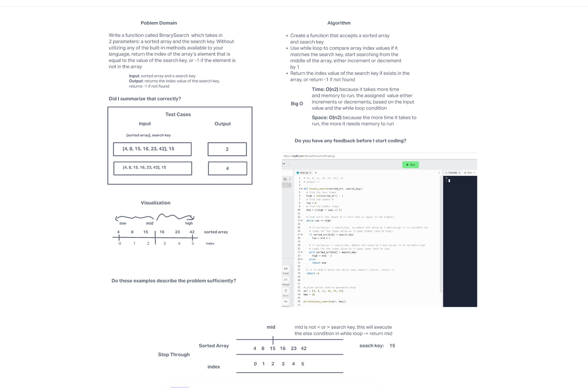

# Reverse an Array
<!-- Description of the challenge -->

Write a function called BinarySearch which takes in 2 parameters: a sorted array and the search key. Without utilizing any of the built-in methods available to your language, return the index of the array’s element that is equal to the value of the search key, or -1 if the element is not in the array.

**NOTE:** The search algorithm used in your function should be a binary search.

## Whiteboard Process
<!-- Embedded whiteboard image -->

## Approach & Efficiency
<!-- What approach did you take? Discuss Why. What is the Big O space/time for this approach? -->

In this code challenge, I created a function binary_search() that accepts two parameters - sorted array and search key. I created variables and assigned them values for the array's lowest and highest indexes. I also created a variable mid that contains the middle index of the given array. A while loop condition is used to loop/search for the search key parameter. It has condition that allows to increment or decrement by 1 until it reaches the index of that search key in the array. It starts searching in the middle of array. If search key is not found, will exit the while loop and continue on the next line of code that returns -1.

The Big O Notation is O(n2) because of the continuous loop and it increments or decrements depending on the input and conditions. It tkes more time and memory to run this code.
